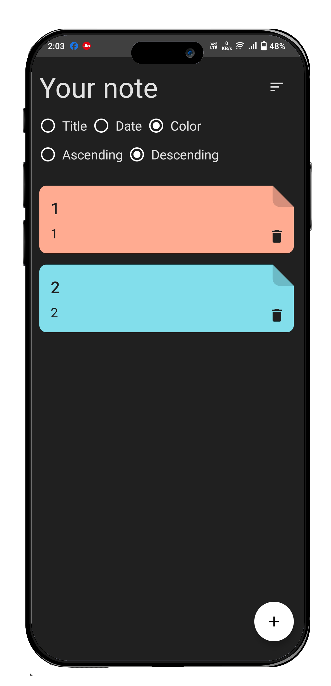
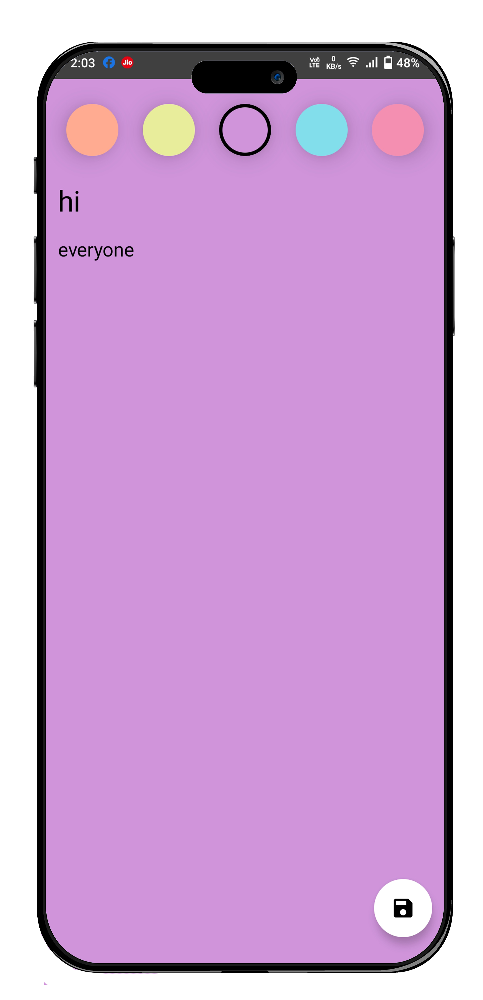
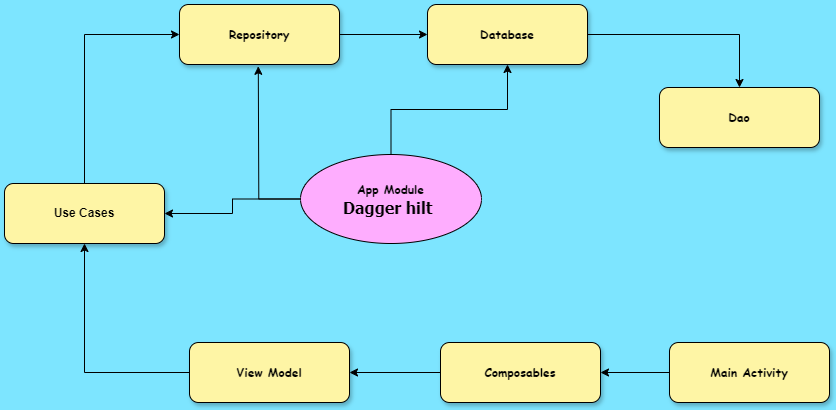

# COMPOSE NOTES APP : A Notes App bulid with jetpack Compose 😍 🔥 🎉

[](https://www.android.com)
[](https://android-arsenal.com/api?level=21)
[]()

---

A Beautiful Notes App build with Jetpack Compose with <B>Clean Architecture</b> 😍

<div align="center">


</div>

# Different Screens 📱📲📳

There are mainly two different screens for the app . the first screen is for the all notes to display and the second screen is for editing and creating the notes . all the screens are having animation and nice look

<table style="width:50%">
  <tr>
    <th><p p align="center"> All Notes </p> </th>
    <th><p p align="center"> Edit Notes </th> </p>
  </tr>
  <tr>
    <td><div  align="center"></td> </div>
    <td><div  align="center"></td></div>
  </td> 
   
  </tr>
</table>

---

## About

Introducing a sleek notes app built with clean architecture, MVVM design pattern, and Jetpack Compose, powered by Dagger Hilt for dependency injection. Enjoy a visually pleasing UI and seamless user experience. Organize your notes effortlessly with intuitive design and robust design patterns. Elevate your productivity with this sophisticated and user-friendly notes app

---

## video

</img>

---

## Clean Architecture

Introducing a sleek notes app built with clean architecture, MVVM design pattern, and Jetpack Compose, powered by Dagger Hilt for dependency injection. Enjoy a visually pleasing UI and seamless user experience. Organize your notes effortlessly with intuitive design and robust design patterns. Elevate your productivity with this sophisticated and user-friendly notes app

---

## Separation of Concern

<table style="width:50%">
  <tr>
    <th><p p align="center">Presentation Layer </p> </th>
    <th><p p align="center"> Data layer  </p></th> 
    <th><p p align="center"> Domain  </p></th> 
  </tr>
  <tr>
    <td><p p align="center"> user interface  </p></td>
    <td><p p align="center"> api access  </p></td>
     <td><p p align="center"> Connecting layer  </p></td> 
  </tr>
  <tr>
    <td><p p align="center"> viem model  </p></td>
    <td><p p align="center"> database access </p></td>
     <td><p p align="center"> Business Logic(fliter,sort,etc)  </p></td> 
  </tr>
  <tr>
    <td><p p align="center"> components  </p></td>
    <td><p p align="center"> database access </p></td>
     <td><p p align="center"> Connecting layer  </p></td> 
  </tr>
  <tr>
    <td><p p align="center">   </p></td>
    <td><p p align="center"> shared preferences </p></td>
     <td><p p align="center"> model classes , defination to repository  </p></td> 
  </tr>
</table>

---

## working

- All the screens are designed completely with jetpack compose
- For injecting the dependencies I am using dagger hilt
- Room database is used to store notes
- use cases is for handling the business logic like(filtering , sorting etc )
- flow is used to provide notes

<div align="center"></div>

---

## Technologies Used

- ### [Dagger Hilt ]
  - Dagger Hilt is a dependency injection library for Android development, built on top of Dagger
  - It simplifies the process of dependency injection by providing a set of predefined components and annotations, reducing boilerplate code and improving readability. Dagger Hilt integrates seamlessly with Jetpack libraries and Android's lifecycle, making it the preferred choice for managing dependencies in modern Android apps
- ### [Clean Architecture]
  - Clean architecture is a software design approach that emphasizes separation of concerns and the dependency rule, with the goal of creating maintainable and scalable codebases. It divides an application into layers, typically including presentation, domain, and data layers, each with specific responsibilities and dependencies. Clean architecture promotes testability, flexibility, and maintainability by enforcing clear boundaries between components and minimizing coupling between them.
- ### [mvvm ]

  - MVVM stands for Model-View-ViewModel, which is a software architectural pattern commonly used in modern UI frameworks, including Android development. In MVVM, the application is divided into three main components:

    1.  Model: Represents the data and business logic of the application.
    2.  View: Represents the UI components visible to the user.
    3.  ViewModel: Acts as an intermediary between the View and the Model, providing data and behavior to the View while
    4.  abstracting away the underlying business logic.

  - MVVM promotes separation of concerns, making it easier to maintain and test the codebase. It also facilitates reusability of components and promotes a more modular architecture.

- ### [jetpack compose]
  - Jetpack Compose is a modern toolkit for building native Android UIs using a declarative approach. It allows developers to create UI components using Kotlin code, with a focus on simplicity, productivity, and performance. With Jetpack Compose, UIs are defined as functions that describe what should be displayed based on the current state of the app. This declarative style simplifies UI development, reduces boilerplate code, and enables powerful features like state management, animations, and theming. Jetpack Compose is part of the Android Jetpack library and is designed to work seamlessly with existing Android APIs and frameworks.

---

## License

```

```

[mvvm]: https://www.geeksforgeeks.org/mvvm-model-view-viewmodel-architecture-pattern-in-android/
[Clean Architechture]: https://betterprogramming.pub/the-clean-architecture-beginners-guide-e4b7058c1165#:~:text=The%20Clean%20Architecture%20is%20the,over%20the%20years.
[Dagger Hilt ]: https://developer.android.com/training/dependency-injection/hilt-android
[jetpack compose ]: https://developer.android.com/develop/ui/compose/documentation
